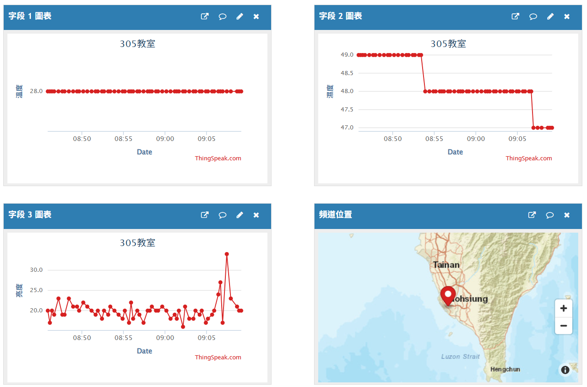
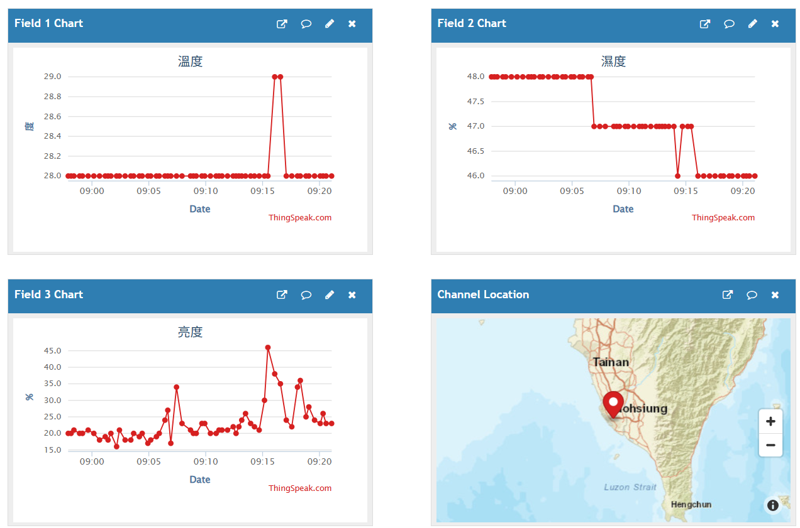
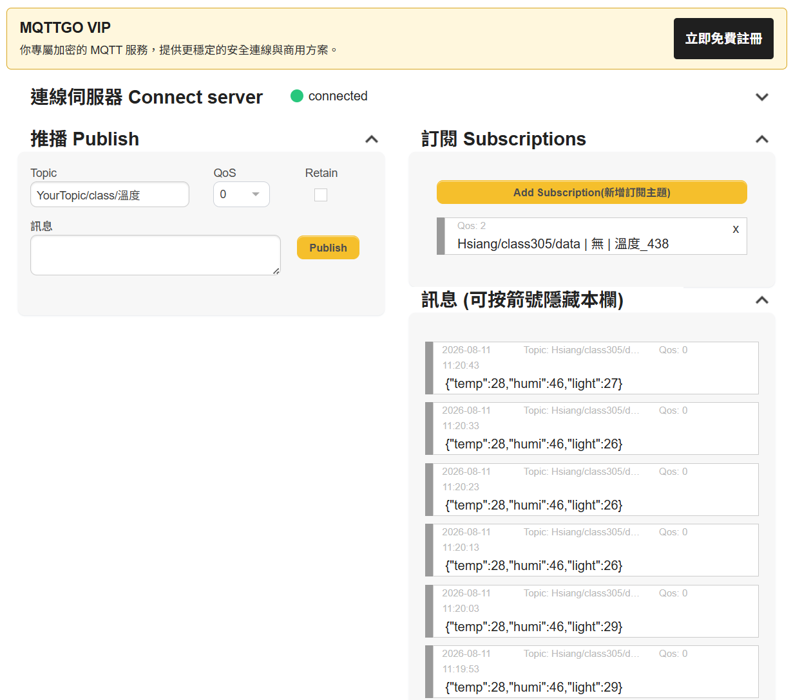
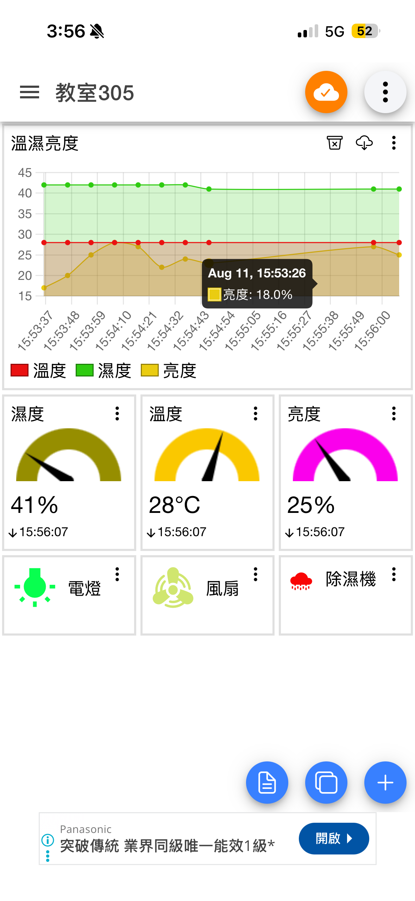
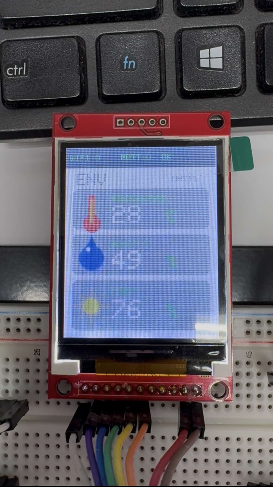
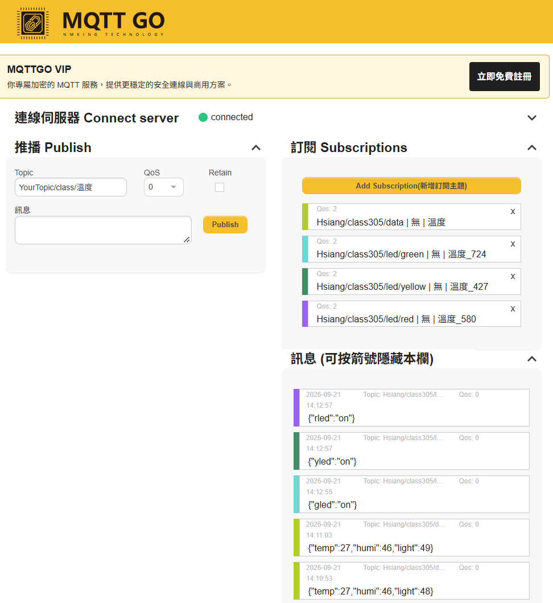

# ESP32 Sensors, MQTT, TFT & E-Paper Examples

本專案是 ESP32 感測器、網路通訊、顯示器與物聯網控制的實作範例集合，涵蓋 GPIO、DHT11、光敏電阻、OLED、TFT、電子紙、HTTP API、ThingSpeak、LINE 與 MQTT。

> 公開版本已將 Wi‑Fi 密碼、API key、ThingSpeak key 與 LINE token 改成 placeholder。請在燒錄前自行填入，不要把真實憑證提交到 Git。

## 快速開始

1. 安裝 Arduino IDE、ESP32 board package。
2. 將 `ESP32/libraries` 中需要的函式庫安裝到 Arduino libraries 目錄；外部函式庫來源記錄在 [.gitmodules](.gitmodules)。
3. 開啟對應資料夾中的 `.ino` 檔案。
4. 修改 `YOUR_WIFI_SSID`、`YOUR_WIFI_PASSWORD`、`YOUR_API_KEY` 等設定。
5. 選擇 ESP32 開發板與序列埠後編譯、上傳。

## 範例照片

### DHT11 + OLED + ThingSpeak

### MQTT、TFT 與電子紙

## 程式範例說明

| 範例 | 功能 |
|---|---|
| [01_hello](ESP32/01_hello) | ESP32 基本啟動與序列埠輸出。 |
| [02_RGLED](ESP32/02_RGLED) | 紅綠 LED 輸出控制。 |
| [03_night_LED](ESP32/03_night_LED) | 夜間 LED 自動控制。 |
| [04_PIR](ESP32/04_PIR) | PIR 人體紅外線感測。 |
| [05_night_3_LED](ESP32/05_night_3_LED) | 夜間三顆 LED 的情境控制。 |
| [06_dht](ESP32/06_dht) | 讀取 DHT11 溫度與濕度。 |
| [07_i2c](ESP32/07_i2c) | I²C 匯流排與裝置掃描。 |
| [08_OLED](ESP32/08_OLED) | OLED 基本文字與圖形顯示。 |
| [09_DHT_OLED](ESP32/09_DHT_OLED) | 將 DHT11 資料顯示在 OLED。 |
| [10_DHT_OLED_GYRBLED](ESP32/10_DHT_OLED_GYRBLED) | 溫濕度顯示與多色 LED 狀態提示。 |
| [11_DHT_OLED_GYRBLED_ALERT](ESP32/11_DHT_OLED_GYRBLED_ALERT) | 溫濕度警報與 LED 提示。 |
| [11_DHT_OLED_GYRBLED_ALERT-2](ESP32/11_DHT_OLED_GYRBLED_ALERT-2) | 警報範例的修正版。 |
| [12_analogWrite_GLED](ESP32/12_analogWrite_GLED) | PWM 調整綠色 LED 亮度。 |
| [13_RGBLED](ESP32/13_RGBLED) | RGB LED 顏色混合與控制。 |
| [14_DHT_OLED_RGBLED](ESP32/14_DHT_OLED_RGBLED) | 依溫濕度狀態控制 RGB LED 並顯示數值。 |
| [15_buzzer](ESP32/15_buzzer) | 蜂鳴器聲音與提示音。 |
| [16_DHT_OLED_RGBLED_Buzzer](ESP32/16_DHT_OLED_RGBLED_Buzzer) | DHT11、OLED、RGB LED 與蜂鳴器整合。 |
| [17_sonic](ESP32/17_sonic) | 超音波距離量測。 |
| [17_sonic-2](ESP32/17_sonic-2) | 超音波距離範例的另一版。 |
| [18_bt_command](ESP32/18_bt_command) | 以 Bluetooth 指令控制 ESP32。 |
| [19_PM2.5](ESP32/19_PM2.5) | 透過網路取得 PM2.5 資料。 |
| [20_PM25_OLED](ESP32/20_PM25_OLED) | 將 PM2.5 資料顯示在 OLED。 |
| [21_Weather_OLED](ESP32/21_Weather_OLED) | 取得氣象資料並顯示在 OLED。 |
| [22_dht_light_oled](ESP32/22_dht_light_oled) | DHT11 與光線感測器的 OLED 儀表。 |
| [23_dht_light_oled_thingspeak](ESP32/23_dht_light_oled_thingspeak) | 上傳溫濕度與光線資料到 ThingSpeak。 |
| [24_google_dht_light_oled](ESP32/24_google_dht_light_oled) | 將感測資料傳送到 Google 服務。 |
| [25_dht_line](ESP32/25_dht_line) | 透過 LINE 傳送感測器通知。 |
| [26_mqtt](ESP32/26_mqtt) | MQTT 感測資料發布與訂閱。 |
| [27_mqtt_ctrl](ESP32/27_mqtt_ctrl) | 以 MQTT 遠端控制輸出元件。 |
| [27_mqtt_retained](ESP32/27_mqtt_retained) | 示範 MQTT retained message。 |
| [28_ili9225](ESP32/28_ili9225) | ILI9225 TFT 基本顯示。 |
| [29_ilicolor](ESP32/29_ilicolor) | ILI9225 彩色圖形與文字。 |
| [30_dht_ili9225](ESP32/30_dht_ili9225) | 在 ILI9225 顯示 DHT11 資料。 |
| [31_ili9225_weather](ESP32/31_ili9225_weather) | 氣象資料與 TFT 顯示整合。 |
| [32_ili9225_gfx_dht](ESP32/32_ili9225_gfx_dht) | 使用 GFX 與 ILI9225 顯示 DHT11。 |
| [32_ili9225_weather_detailed](ESP32/32_ili9225_weather_detailed) | 詳細氣象資訊 TFT 儀表。 |
| [32_ili9225_weather_detailed-1](ESP32/32_ili9225_weather_detailed-1) | 詳細氣象儀表的另一版實作。 |
| [33_ili_mqtt](ESP32/33_ili_mqtt) | TFT 顯示 MQTT 感測資料。 |
| [34_ili_mqtt_ctrl](ESP32/34_ili_mqtt_ctrl) | TFT 介面搭配 MQTT 遠端控制。 |
| [35_ili_mqtt_ctl_page](ESP32/35_ili_mqtt_ctl_page) | 以頁面式 TFT 介面控制 MQTT 裝置。 |
| [36_epaper](ESP32/36_epaper) | 電子紙基本初始化與顯示。 |
| [37_epaper_dht](ESP32/37_epaper_dht) | 電子紙顯示 DHT11 溫濕度。 |
| [38_epaper_mqtt](ESP32/38_epaper_mqtt) | 電子紙顯示 MQTT 感測資料與控制狀態。 |

## 注意事項

- Wi‑Fi、雲端服務與 MQTT 設定請放在本機未追蹤的設定檔或 placeholder 中。
- `.arduino-build*`、`build_upload` 與暫存檔已排除，不應提交編譯輸出。
- 使用第三方函式庫時，請遵守各函式庫的授權條款。
